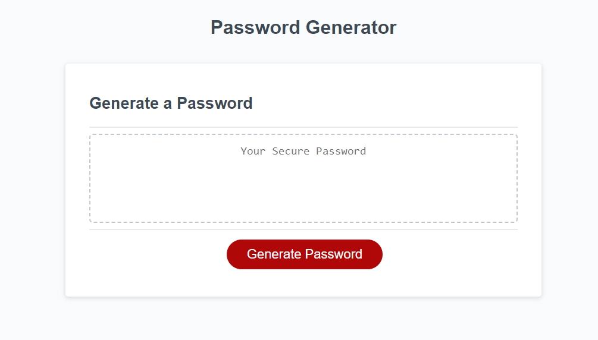

# Password Generator

## Description

This project was meant to add the code fo a password generator, which allows a user to select the character types (special, lowercase, uppercase, and numbers) as well as the length of the password that they want to generate. With one press of a button, they get a random password that they can copy off the form.

## Installation

Use Git to clone this repository.

git clone password-generator

Finished site here:

https://codeclass0.github.io/password-generator/

## Usage

Click the link above, or view the finished project screenshot below.

